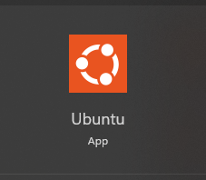
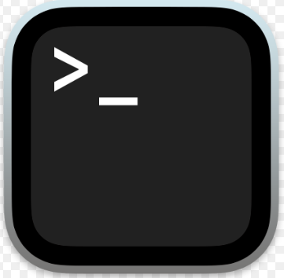

# Step 1 - Install a Linux system

## Windows user to download WSL (windows subsystem for Linux)

Follow this [Microsoft tutorial](https://learn.microsoft.com/en-us/windows/wsl/install) to install WSL on your Windows operating system. Choose Ubuntu as the Linux distribution to dowanload and install. 

__WSL (Windows Subsystem for Linux)__ is a compatibility layer that allows you to run a Linux environment directly on Windows without the need for a virtual machine or dual-boot setup. It enables users to execute Linux commands, run Linux applications, and use Linux tools alongside Windows programs. 

Since we are learning how to use the Linux system in this workshop, so it's necessary for us to have a Linux system ready on our device. That's why we are installing WSL. 

Once you have successfully installed the Ubuntu WSL, you can open the Ubuntu App to use it everytime.



## Mac user

MacOS user don't need to install a Linux system because MacOS is a Unix-based system. It is built on a Unix foundation, and it supports a command-line interface (Terminal) similar to Linux. So the basic commands we are learning for Linux can be run on MacOS as well.

Open Terminal to use it.



# Step 2 - Installing software needed for the variant calling pipeline

* Install Anaconda
* Create a conda environment
* Install packages using conda
* Download data 
* Install IGV 

## Install Anaconda

__Anaconda__ is an open-source package and environment management system commonly used in data science, scientific computing, and machine learning projects. It allows you to install, update, and manage software packages and dependencies for your projects. It supports packages written in various programming languages, with a focus on Python packages. 

We will use Anaconda as the software management system to install all the packages that are needed for our variant calling workflow. 

__For Windows Users:__

You need to download and install Anaconda in __WSL__. So the first step is to open the Ubuntu App. Then, run the following commands:

```sh 
# change directory to home 
cd ~

# wget is a command to download files from the internet
wget https://repo.anaconda.com/archive/Anaconda3-2024.10-1-Linux-x86_64.sh

# run the installer to install 
bash Anaconda3-2024.10-1-Linux-x86_64.sh 
```

You will be prompted with some questions in the installation process, press `enter` or type `yes` then `enter` to continue. When you see `--MORE--` at the bottom of the terminal, press `space` bar to move to the next page of the document. When you are asked to decide the installation location, just press `enter` to use the default path. After the installation finishes, use `exit` command to exit the terminal and restart a new one.

In the terminal, run the following command to check if conda has been successfully installed:

```sh
conda --version
```

You should see `conda 24.10.1` printed on the screen.

__For MacOS Users:__

Go to this [page](https://www.anaconda.com/download/success) and pick the suitable installer for your device, choose the graphical installer. Follow the instructions to install, when it asks you to select destination, please chosse `Install for me only`. 

After installation, open a new terminal and run the following code to check if Anaconda has been successfully installed. 

```sh
conda --version 
```

You should see a version number printed on your screen. 

## Set up conda channels 

A __Conda channel__ is a repository where conda packages are stored and from which conda downloads and installs packages. Channels are hosted on platforms like __Anaconda Cloud__ and can contain different versions of software for various platforms. Popular channels include `defaults`, `conda-forge`, and `bioconda`. We are going to set up our conda channels to the order of `conda-forge -> bioconda -> defaults`. 

__First, check your current channels:__

```sh
conda config --show channels
```

Output might look like this:

```
channels:
  - defaults
```
__Add new channels:__

We are going to add both `conda-forge` and `bioconda`.

```sh
conda config --add channels bioconda
conda config --add channels conda-forge
```

Now, check again:

```sh
conda config --show channels
```

Expected output:

```
channels:
  - conda-forge
  - bioconda
  - defaults
```

Channels are checked in order from top to bottom, so `conda-forge` will be prioritised. 

## Create a new conda environment 

A conda environment is a self-contained directory that contains a specific collection of software packages, along with the necessary dependencies and their respective versions. Using conda environments can avoid conflicts between projects or applications that may require different versions of libraries or dependencies. This isolation ensures that your projects have a consistent and reproducible environment, making it easier to share and collaborate with others. 

In this workshop, we will work on a small project where we find the variants of some DNA sequencing data of *E.coli.* This bioinformatic process is called variant calling. So, we can create a new conda environment called `ecoli-vc`, and install the needed packages in this environment. 

__Run the following to create a conda environment:__

```sh
conda create --name ecoli-vc
```

You will be prompted with a question asking if you want to proceed, type `y` and press `enter` to continue. 

After creating the environment, the next step is to activate the environment. If we don't activate the environment, we can't use the software we installed in it nor to install something into the environment. 

```sh
conda activate ecoli-vc
```

__For MacOS with Apple chips, there is one additional step:__

```sh
conda config --env --set subdir osx-64
```

## Install packages

After activating the environment, we can start to install packages. There are 5 packages we need for the variant calling pipeline. They are:

* FastQC
* Trimmomatic
* BWA 
* Samtools
* Bcftools

Run the following commands line by line to install. You will be prompted with questions asking if you want to proceed, type `y` and press `enter` to continue. 

```sh
conda install -c bioconda fastqc
conda install -c bioconda trimmomatic
conda install -c bioconda bwa
conda install -c bioconda samtools
conda install -c bioconda bcftools
```

After installation finishes, run the following commands to verify if the packages are successfully installed. As of date 18 Feb 2025:

```sh
fastqc --version #v0.12.1
trimmomatic -version #0.39
bwa # prompt with usage, version: 0.7.18-r1243-dirty
samtools --version #1.21 Using htslib 1.21
bcftools --version #1.21 Using htslib 1.21
```

## Download data 

The data we are going to use in this workshop is DNA sequencing data from *E. coli*, it is part of a long-term evolution experiment led by [Richard Lenski](https://en.wikipedia.org/wiki/E._coli_long-term_evolution_experiment). We will talk more about the background later in the class.

In your terminal, run the following codes to download the needed files:

```sh
# create a new directory where we store the files
mkdir -p ~/variant-calling/raw-fastq

# go into the directory we just created
cd ~/variant-calling/raw-fastq

# curl is a command to download files from the internet
curl -O ftp://ftp.sra.ebi.ac.uk/vol1/fastq/SRR258/004/SRR2589044/SRR2589044_1.fastq.gz
curl -O ftp://ftp.sra.ebi.ac.uk/vol1/fastq/SRR258/004/SRR2589044/SRR2589044_2.fastq.gz
curl -O ftp://ftp.sra.ebi.ac.uk/vol1/fastq/SRR258/003/SRR2584863/SRR2584863_1.fastq.gz
curl -O ftp://ftp.sra.ebi.ac.uk/vol1/fastq/SRR258/003/SRR2584863/SRR2584863_2.fastq.gz
curl -O ftp://ftp.sra.ebi.ac.uk/vol1/fastq/SRR258/006/SRR2584866/SRR2584866_1.fastq.gz
curl -O ftp://ftp.sra.ebi.ac.uk/vol1/fastq/SRR258/006/SRR2584866/SRR2584866_2.fastq.gz
```

It takes around 15 minutes to download. 

## Install IGV

Integrative Genomics Viewer (IGV) is a powerful and widely used visualisation tool for exploring and analysing genomic data, it allows researchers to interactively visualise and analyse various types of genomic data, including DNA sequencing data, gene expression data, epigenetic data, and more. 

We are going to use IGV to look at the results we get from variant calling. Go to the [IGV website](https://software.broadinstitute.org/software/igv/download) and pick the right one to download for your device. Choose the one with Java included. __Windows users to download the Windows version not the Linux version__. 